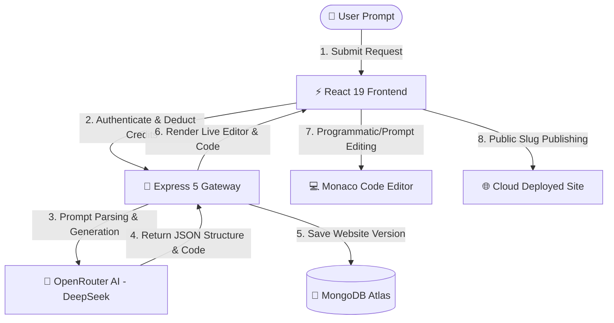

<div align="center">

# 🌟 GenWeb.ai — AI Website Generator

**Enterprise-grade SaaS Platform for AI-Driven Web Application Generation, Real-Time Monaco Code Editing, Instant Cloud Deployment, and Automated Token Economics.**

[](https://nodejs.org/)
[](https://react.dev/)
[](https://expressjs.com/)
[](https://www.mongodb.com/)
[](https://tailwindcss.com/)
[](https://openrouter.ai/)
[](https://stripe.com/)
[](./LICENSE.md)

[Features](#-features) • [Tech Stack](#%EF%B8%8F-tech-stack--tools) • [Quick Start](#-quick-start) • [API Docs](#-api-documentation) • [Architecture](#-project-structure) • [Deployment](#-deployment)

---

</div>

## 🌟 Overview

**GenWeb.ai** is a modern, enterprise-ready MERN stack SaaS application that empowers users to create, preview, edit, and publish full-fledged web applications in seconds using natural language prompts. 

Powered by **DeepSeek LLM** via **OpenRouter**, GenWeb.ai translates intuitive textual instructions into clean, modern, and production-grade HTML5, CSS3 (Tailwind CSS), and JavaScript code. Featuring an integrated **Monaco Code Editor** (the engine behind VS Code) and an instant sandbox preview, users can fine-tune generated layouts both programmatically and iteratively through conversational AI.



---

## 🛠️ Tech Stack & Tools

### **Frontend Infrastructure**
| Category | Technology | Description |
| :--- | :--- | :--- |
| **Framework** | [React 19](https://react.dev/) | Core UI rendering library utilizing latest React features |
| **Build System** | [Vite 8](https://vitejs.dev/) | Next-generation frontend tooling and instant HMR |
| **State Management** | [Redux Toolkit](https://redux-toolkit.js.org/) | Centralized application state management |
| **Styling** | [Tailwind CSS v4](https://tailwindcss.com/) | Utility-first CSS framework with Vite plugin integration |
| **Code Editor** | [Monaco Editor](https://microsoft.github.io/monaco-editor/) | In-browser code editing suite with syntax highlighting |
| **Routing** | [React Router v7](https://reactrouter.com/) | Declarative client-side routing and navigation |
| **Animations** | [Motion](https://motion.dev/) | High-performance React animation engine |
| **Iconography** | [Lucide React](https://lucide.dev/) | Clean, customizable SVG icons |
| **HTTP Client** | [Axios](https://axios-http.com/) | Promise-based HTTP client for API interactions |

### **Backend Infrastructure**
| Category | Technology | Description |
| :--- | :--- | :--- |
| **Runtime** | [Node.js](https://nodejs.org/) | Server-side JavaScript runtime environment |
| **Web Framework** | [Express 5](https://expressjs.com/) | Lightweight and high-performance server framework |
| **Database** | [MongoDB](https://www.mongodb.com/) / [Mongoose 9](https://mongoosejs.com/) | NoSQL database ODM for persistent user & site storage |
| **Authentication** | [Firebase Auth](https://firebase.google.com/) + JWT | Hybrid authentication (Google Sign-In & HTTP-only JWTs) |
| **Rate Limiting** | [Express Rate Limit](https://www.npmjs.com/package/express-rate-limit) | Protection against DDoS and AI endpoint abuse |
| **Billing** | [Stripe SDK](https://stripe.com/) | Complete payment engine with webhook event handling |
| **AI Integration** | [OpenRouter SDK](https://openrouter.ai/) | High-speed LLM inference gateway (`deepseek-chat`) |

---

## ✨ Features

- 🤖 **AI-Driven Web Generation**: Generates responsive, multi-section web interfaces directly from natural language prompts using DeepSeek.
- 💬 **Conversational Revisions**: Continuously refine website design and functionality by chatting with AI (e.g., *"Change primary color to Indigo and add a Pricing Section"*).
- 💻 **Embedded Monaco Editor**: Professional code editor with syntax highlighting, autocomplete, auto-formatting, and real-time code sync.
- 📱 **Responsive Preview Sandbox**: Switch between Desktop, Tablet, and Mobile views instantly to verify responsive UI design.
- 🚀 **One-Click Cloud Deployment**: Publish websites with unique, shareable public slugs (`/site/:slug`).
- 💳 **Credit Economy & Tiered SaaS Plans**: Built-in subscription plans (`Free`, `Pro`, `Enterprise`) and token-based usage enforcement.
- 🔒 **Enterprise-Grade Rate Limiting**: Dual-layer rate limiting protecting both general endpoints and costly AI generation routes.
- ⚡ **Automated Stripe Webhooks**: Real-time balance updates and tier migrations triggered upon payment completion.

---

## 🎬 Project Preview


---

## ⚡ Quick Start

### **Prerequisites**
Ensure you have the following software and accounts configured:
- **Node.js**: `v18.0.0` or higher
- **npm**: `v9.0.0` or higher
- **MongoDB**: Active MongoDB Atlas cluster or local MongoDB instance
- **OpenRouter API Key**: Obtain from [OpenRouter.ai](https://openrouter.ai/)
- **Stripe Account**: API Keys & Webhook Secret from [Stripe Dashboard](https://dashboard.stripe.com/)
- **Firebase Project**: Web app configuration from [Firebase Console](https://console.firebase.google.com/)

---

## 📦 Installation

### **1. Clone the Repository**
```bash
git clone https://github.com/PranavThorat1432/GenWeb.ai-an-AI-Website-Generator.git
cd GenWeb.ai-an-AI-Website-Generator
```

### **2. Install Server Dependencies**
```bash
cd Server
npm install
```

### **3. Install Client Dependencies**
```bash
cd ../Client
npm install
```

---

## ⚙️ Configuration

Create `.env` files in both the `Server` and `Client` directories using the reference schemas below.

### **Server Environment Variables (`Server/.env`)**

| Variable Name | Type | Description | Default / Example |
| :--- | :--- | :--- | :--- |
| `PORT` | Number | Server listener port | `5000` |
| `MONGODB_URL` | String | MongoDB connection URI string | `mongodb+srv://<user>:<password>@cluster.mongodb.net/GenWeb` |
| `JWT_SECRET` | String | Secret key for signing HTTP-only cookies | `super_secret_jwt_key` |
| `NODE_ENV` | String | Runtime environment (`development` / `production`) | `development` |
| `FRONTEND_URL` | String | Authorized Client origin for CORS | `http://localhost:5173` |
| `OPENROUTER_API_KEY` | String | API Key for OpenRouter AI API | `sk-or-v1-...` |
| `STRIPE_SECRET_KEY` | String | Stripe Secret key for server requests | `sk_test_...` |
| `STRIPE_PUBLISHABLE_KEY`| String | Stripe Publishable key | `pk_test_...` |
| `STRIPE_WEBHOOK_SECRET` | String | Webhook signing secret from Stripe CLI / Dashboard | `whsec_...` |

### **Client Environment Variables (`Client/.env`)**

| Variable Name | Type | Description | Example |
| :--- | :--- | :--- | :--- |
| `VITE_SERVER_URL` | String | Base URL of the backend API | `http://localhost:5000` |
| `VITE_FIREBASE_API_KEY` | String | Firebase Web API Key for authentication | `AIzaSy...` |

---

## 🎯 Usage

### **Starting Development Servers**

#### **Start Backend Server:**
```bash
cd Server
npm run dev
# Server running at http://localhost:5000
```

#### **Start Frontend Client:**
```bash
cd Client
npm run dev
# Application available at http://localhost:5173
```

---

## 📚 API Documentation

### **1. Authentication Routes (`/api/auth`)**
| Method | Endpoint | Access | Description |
| :--- | :--- | :--- | :--- |
| `POST` | `/api/auth/google` | Public | Authenticates user via Google OAuth & issues HTTP-only JWT cookie |
| `GET` | `/api/auth/logout` | User | Clears authentication session cookie |

### **2. User Profile Routes (`/api/user`)**
| Method | Endpoint | Access | Description |
| :--- | :--- | :--- | :--- |
| `GET` | `/api/user/get-user` | Protected | Fetches current user profile, plan tier, and remaining credit tokens |

### **3. AI & Website Management (`/api/website`)**
| Method | Endpoint | Rate Limit | Description |
| :--- | :--- | :--- | :--- |
| `POST` | `/api/website/generate` | 10 req / 15m | Parses prompt, deducts credits, and returns generated site code |
| `GET` | `/api/website/get/:id` | Standard | Retrieves website data and conversation history by ID |
| `POST` | `/api/website/update/:id` | 10 req / 15m | Performs prompt-based AI revisions on existing code |
| `GET` | `/api/website/get-all` | Standard | Returns list of all websites created by authenticated user |
| `GET` | `/api/website/deploy/:id` | Standard | Publishes website and generates public routing slug |
| `GET` | `/api/website/get-slug/:slug` | Public | Fetches deployed site payload by unique public slug |

### **4. Billing & Subscription (`/api/billing`)**
| Method | Endpoint | Access | Description |
| :--- | :--- | :--- | :--- |
| `POST` | `/api/billing` | Protected | Initiates Stripe Checkout Session for plan upgrade / credits |
| `POST` | `/api/stripe/webhook` | Stripe System | Raw body Stripe Webhook listener verifying signatures & fulfilling top-ups |

---

## 🎨 UI/UX Features

- **Modern Glassmorphic Visual Theme**: Sleek dark-mode visual hierarchy with polished translucent containers and gradient accents.
- **Monaco Code Editing Suite**: Full VS Code engine integration providing line numbers, code folding, bracket matching, and real-time syncing.
- **Multi-Device Viewport Sandbox**: Toggle live web view between Desktop (`100%`), Tablet (`768px`), and Mobile (`375px`) dimensions.
- **Dynamic Micro-Interactions**: Smooth state transitions powered by Motion engine for high-touch user engagements.

---

## 📁 Project Structure

```
GenWeb.ai-an-AI-Website-Generator/
├── Client/                             # React 19 Frontend Application
│   ├── public/                         # Static Web Assets
│   ├── src/
│   │   ├── assets/                     # Graphics & Media Dependencies
│   │   ├── Components/                 # Reusable UI Components
│   │   │   ├── Cta.jsx                 # Call-To-Action Component
│   │   │   ├── Faq.jsx                 # Frequently Asked Questions Component
│   │   │   ├── Features.jsx            # Platform Features Grid
│   │   │   ├── Footer.jsx              # Global Site Footer
│   │   │   ├── HowItWorks.jsx          # Workflow Step Component
│   │   │   ├── LoginModal.jsx          # Firebase Google Auth Modal
│   │   │   └── Testimonials.jsx        # User Testimonials Carousel
│   │   ├── Hooks/                      # Custom React Hooks
│   │   │   └── useGetCurrentUser.jsx   # Auth User Hydration Hook
│   │   ├── Lib/                        # Utility Libraries & Firebase SDK
│   │   │   └── firebase.js             # Firebase App Initialization
│   │   ├── Pages/                      # Application Page Routes
│   │   │   ├── Dashboard.jsx           # User Projects & Analytics Dashboard
│   │   │   ├── EditorPage.jsx          # Monaco Editor & Preview Workbench
│   │   │   ├── Generate.jsx            # AI Prompt Input Studio
│   │   │   ├── Home.jsx                # Landing Page
│   │   │   ├── LiveSite.jsx            # Deployed Website Renderer
│   │   │   └── Pricing.jsx             # Plan Upgrade & Subscription Page
│   │   ├── Redux/                      # State Management Store
│   │   │   ├── Slices/                 # Redux Toolkit Slices
│   │   │   │   └── userSlice.js        # User Profile State Slice
│   │   │   └── store.js                # Redux Store Configuration
│   │   ├── App.jsx                     # Master Route Definitions
│   │   ├── index.css                   # Global Tailwind CSS Entry Point
│   │   └── main.jsx                    # React Application DOM Mounting
│   ├── .env                            # Frontend Environment Configuration
│   ├── package.json                    # Client Node Dependencies & Scripts
│   └── vite.config.js                  # Vite Build Engine Configuration
│
├── Server/                             # Node.js / Express 5 API Server
│   ├── src/
│   │   ├── Config/                     # Third-Party API Configurations
│   │   │   ├── mongoDB.js              # Database Connection Driver
│   │   │   ├── openRouter.js           # AI DeepSeek Gateway & Retry Backoff
│   │   │   ├── plan.js                 # Plan Tiers & Credit Allocation Matrix
│   │   │   └── stripe.js               # Stripe SDK Instance
│   │   ├── Controllers/                # Business Logic Handlers
│   │   │   ├── authController.js       # Google Sign-In & Cookie Session Controller
│   │   │   ├── billingController.js    # Stripe Checkout Session Generator
│   │   │   ├── stripeWebhookController.js # Payment Webhook Fulfillment
│   │   │   ├── userController.js       # User Profile Data Supplier
│   │   │   └── websiteController.js    # AI Generation & Code Management Engine
│   │   ├── Middleware/                 # Express Request Middlewares
│   │   │   └── isAuth.js               # JWT Auth Cookie Validator
│   │   ├── Models/                     # Mongoose Data Schemas
│   │   │   ├── userModel.js            # User Profile & Credit Schema
│   │   │   └── websiteModel.js         # Project, Code, & Chat Schema
│   │   ├── Routes/                     # Express REST Route Definitions
│   │   │   ├── authRoutes.js           # Auth Endpoints Router
│   │   │   ├── billingRoutes.js        # Billing Router
│   │   │   ├── userRoutes.js          # User Router
│   │   │   └── websiteRoutes.js        # AI & Website Router
│   │   └── Utils/                      # Server Utility Helpers
│   │       └── extractJSON.js          # JSON Sanitization Helper for AI Responses
│   ├── .env                            # Backend Environment Configuration
│   ├── package.json                    # Server Dependencies & Scripts
│   └── server.js                       # Express Application Server Entrypoint
│
├── LICENSE.md                          # Project License Information
└── README.md                           # Enterprise Documentation
```

---

## 🧪 Testing

### **Linting & Code Formatting**
Validate JavaScript code quality and standard React hook rules:
```bash
cd Client
npm run lint
```

### **Stripe Webhook Testing**
To test payment webhooks locally using the Stripe CLI:
```bash
stripe listen --forward-to localhost:5000/api/stripe/webhook
```

---

## 🚀 Deployment

### **Backend Deployment (Render / Railway / AWS)**
1. Set Environment Variables in your cloud hosting provider dashboard (matching `Server/.env`).
2. Set Build Command: `npm install`
3. Set Start Command: `node server.js`

### **Frontend Deployment (Vercel / Netlify)**
1. Connect repository branch to Vercel/Netlify.
2. Set Build Command: `npm run build` (Outputs to `dist/`).
3. Configure `VITE_SERVER_URL` in environment variables to point to production backend.

---

## 🤝 Contributing

Contributions are welcome! Please follow the steps below:

1. **Fork the Repository**
2. **Create a Feature Branch** (`git checkout -b feature/AmazingFeature`)
3. **Commit your Changes** (`git commit -m 'Add some AmazingFeature'`)
4. **Push to the Branch** (`git push origin feature/AmazingFeature`)
5. **Open a Pull Request**

---

## 📄 License

Distributed under the **ISC License**. See [`LICENSE.md`](./LICENSE.md) for more information.

---


## 📞 Contact & Support

| Platform              | Link                                                          |
| --------------------- | ------------------------------------------------------------- |
| 🧑 **Author**      | Pranav Thorat                      |
| 🌐 **Live Demo**      | [View Now](https://genweb-ai-6w1p.onrender.com)                        |
| 🧑‍💻 **GitHub Repo** | [View Code](https://github.com/PranavThorat1432/GenWeb.ai-an-AI-Website-Generator) |
| 💼 **LinkedIn**       | [Connect with Me](https://www.linkedin.com/in/curiouspranavthorat)       |
| 📩 **Email**          | [pranavthorat95@gmail.com](mailto:pranavthorat95@gmail.com)   |


---

<div align="center">

**⭐ If you find this project helpful, please give it a star!**

**🚀 Happy Learning & Teaching!**

</div>

---

<div align="center">
Made with ❤️ by <a href="https://github.com/PranavThorat1432">Pranav Thorat</a>
</div>
